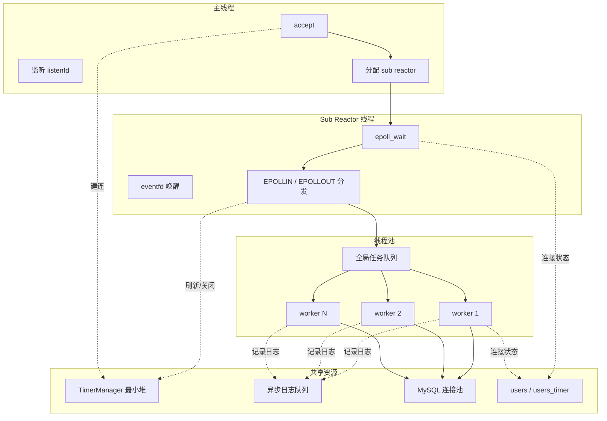

# 架构说明

这份文档对应 `WebServer-1.0` 与 `WebServer-2.0` 的版本对比。

## 优化部分
- 主从 reactor：`WebServer-2.0/WebServer.h` 里新增 `SubReactor`、`eventfd`、`std::thread`、`std::atomic<size_t> m_next_sub`。
- 定时器：`WebServer-2.0/lst_timer/lst_timer.h` 和 `lst_timer.cpp` 改成 `std::priority_queue` 最小堆，使用 `std::chrono::steady_clock` 和 `token` 做懒删除。
- 日志：`WebServer-2.0/log/log.cpp` 使用 `std::filesystem::path`、`create_directories()`、异步写线程 `writer_`、批量刷盘。
- 线程池：`WebServer-2.0/threadpool/threadpool.h` 去掉了 `actor_model` 分支，只保留 `append_p()` 和 `request->process()`。
- 连接计数：`WebServer-2.0/http/http_conn.h` 把 `m_user_count` 改成 `std::atomic<int>`。
- 连接归属：`WebServer-2.0/http/http_conn.cpp` 为每个连接保存自己的 `m_epollfd`，关闭时按归属 epoll 删除 fd。

## 请求流
```mermaid
flowchart TD
    C[客户端] --> M[主线程 listenfd epoll_wait]
    M --> A[accept 新连接]
    A --> S[分配给某个 sub reactor]
    S --> R[把连接注册到 sub epoll]
    R --> IR[EPOLLIN 触发]
    IR --> RD[read_once 读取请求]
    RD --> Q[投递到线程池]
    Q --> P[worker 执行 process()]
    P --> W[生成响应并切到 EPOLLOUT]
    W --> OR[sub reactor 监听 EPOLLOUT]
    OR --> WR[write 回客户端]
    WR --> K{keep-alive?}
    K -->|是| R
    K -->|否| X[关闭连接]
```

## 线程模型


## 关于为何优化后的版本QPS不如原版
    首先，我在对定时器和日志系统进行优化的时候QPS是有几百的提升的，提升不高说明这个项目的瓶颈并不在这上面（我打过火焰图，开销最大的部分在unmap,也就是进程虚拟地址空间映射那个部分，但那个开销是必要的开销），但毋庸置疑，将定时器链表改成最小堆+懒删除和对日志系统的优化是有收益的。日志系统我写成了一个类似于生产者消费者模型的模式，用 std::thread + std::condition_variable 做真正的后台写线程，队列里存 std::string，生产者只负责格式化和移动入队，写线程一次批量刷多条，不像原版每写一次都要刷一次（当然测最高QPS肯定是要关日志的）。
    到此为止，我所做的优化均为正收益，直到我把proactor删去改成了主从reactor
    我当时觉得epoll模型天然支持reactor模式，事件驱动，分发，我当时觉得主从reactor模式太美妙了，父reactor只负责监听和分发，从reactor负责读写逻辑和业务处理，极大降低了耦合性，简直就是epoll模型的最佳队友，我当时没想这么多，只想着等我做完这个主从reactor，QPS一定会爆炸吧。但正如结果所示，我大错特错，我当时没有想到主从reactor模式同样有线程调度和锁开销，而这些开销又恰好吃掉了他们天然契合epoll模型的收益。主从reactor并不是所有场景下都必胜的，他的优势并不在静态的小请求里体现，这里的项目明显是静态的小请求，主从 reactor 的优势场景，本质上是“单个事件循环已经扛不住，而且系统里有足够多可并行的工作”的时候。比如高并发连接数很大，单个 epoll 线程开始成为瓶颈。
    连接生命周期长，keep-alive 多、事件持续不断，分摊到多个 从reactor 后更稳。
    读写事件很多，不是一次请求就结束，而是频繁收发、状态切换多。
    有明显业务处理开销，比如数据库、文件系统、解析、加密、压缩、RPC，这些能把 I/O 等待和计算拆开。
    慢客户端 / 大响应 / 阻塞风险高，某些连接很“磨叽”，主从结构能避免拖住整条主循环。
    多核机器且分片做得干净，每个 sub reactor 管自己的连接和队列，少共享锁、少全局热点。
    是的，理论上主从reactor是优秀的模型，muduo网络库的底层就是主从reactor，但是实际开发还是得看需求和生产环境嘛。

    写了这么多其实也不会有人去看，但万一呢（），我也是个初学者，但是能看到我这个项目的你应该也是初学者吧？我一直认为c++不只是一门语言，更是一个艺术品，极高程度的抽象，允许你控制一切底层的自由，每一项无不令我沉醉其中。或许当你看到这个项目的时候已经过去了几年，而我已经拿到ssp offer开始大展拳脚（幻想中），总之，如果你也是是初学者，或许我能帮你些什么（我的QQ是2943570947，欢迎来加我）。今年20 百度 阿里等四家大厂同时给我发来职业直邀（bushi）.
